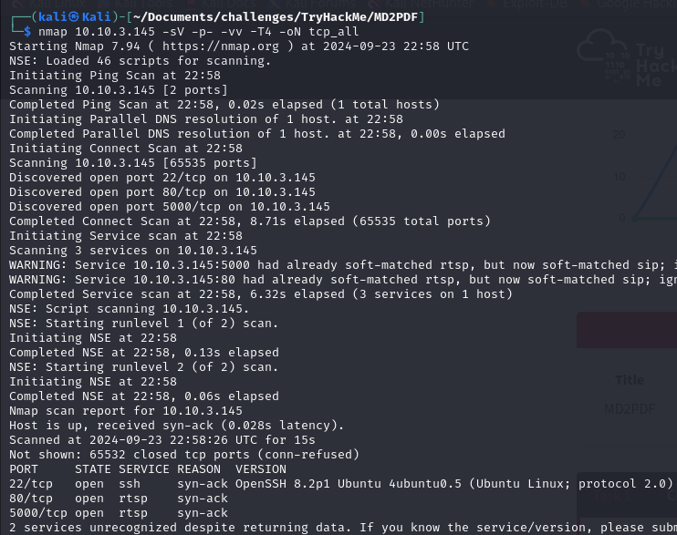
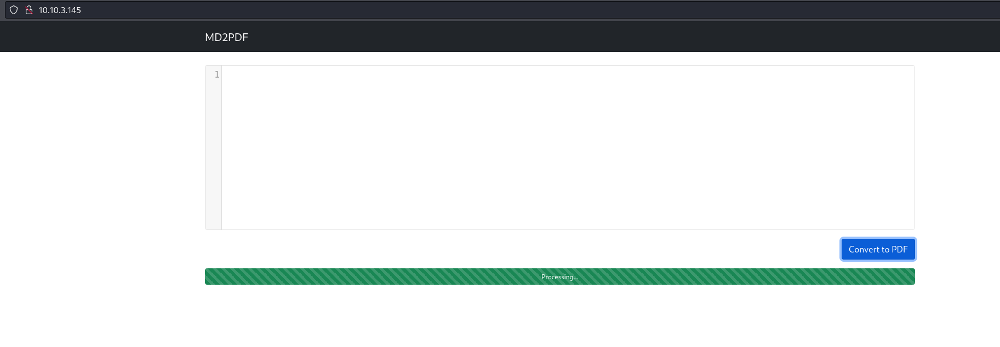
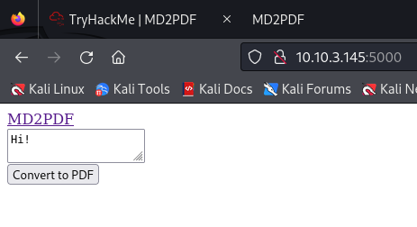
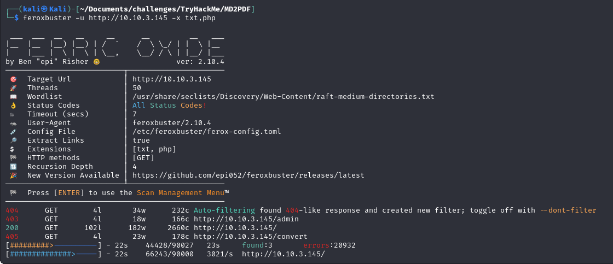
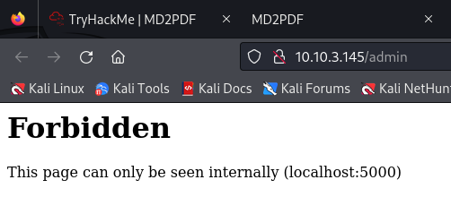
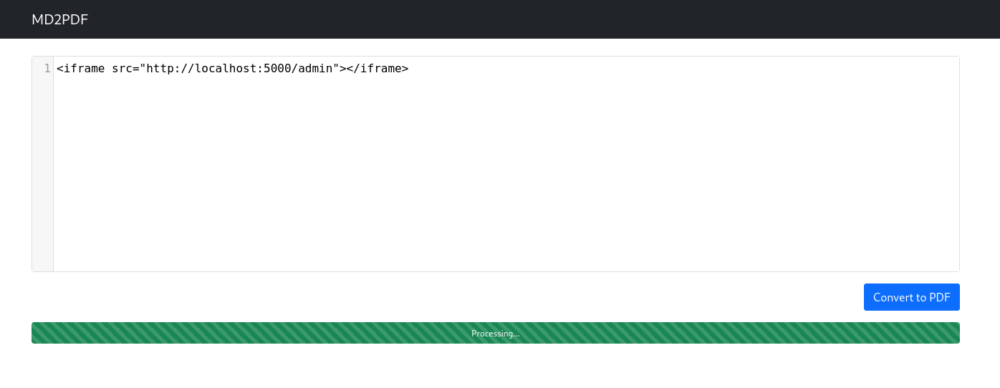
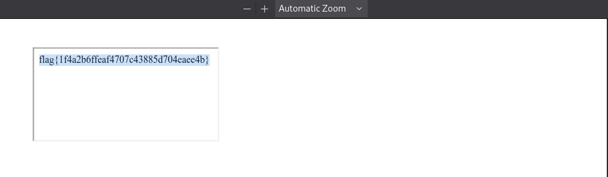

# MD2PDF

The MD2PDF room on TryHackMe offers an excellent opportunity to practice and explore XSS (Cross-site Scripting) and SSRF (Server-Side Request Forgery) vulnerabilities.

### Reconnaissance

Since this challenge provides little information and lacks a clear description of the objective, a good starting point is to conduct an Nmap scan: 

  

`nmap 10.10.3.145 -sV -p- -vv -T4 -oN tcp_all`
  
  
We see that three ports are open: port **22** for **SSH**, and ports **80** and **5000**, which are not recognized as any specific services. Since port **80** is typically used for **HTTP**, we assume this is the case here as well. We can easily confirm this by visiting the target's IP address in a web browser: 

  

`http://10.10.3.145 (default port 80)`
  
  
Port **5000** also displays a web page, which looks very similar to the one on port **80** but has no additional functionality:

  
`http://10.10.3.145:5000`
  
  
To discover whether the web server has other pages or files available, we perform a web scan on the IP address using a fuzzing tool called `feroxbuster`:

`feroxbuster -u http://10.10.3.145 -x txt,php`
  
  
Meanwhile, we inspect the text field on the main page, which, as the room's title suggests, converts markdown (MD) text into a PDF file.

When entering a simple HTML syntax (in our example:  
`<a href="http://malicious-site.com">Click me!</a>`) we see that it gets executed, making the website vulnerable to **XSS**.

  
  
With `feroxbuster`, we discover a directory called `/admin`. Upon visiting this directory, we are greeted by the following page: 

### Exploitation

If an XSS or SSRF vulnerability exists in the PDF generator, we could potentially exploit it to access private server files or make requests on behalf of the server. The error message displayed on the page suggests that this might be possible.

Since we know the PDF generator's text field accepts HTML markup, we attempt to use an `<iframe>` as a payload to view the contents of `/admin` through port 5000. As `/admin` only allows internal requests, we try to submit a request using **SSRF** via the server.

  
  
The generated PDF should now reveal the `/admin` directory since the request was made through the server, rather than from our IP address.

The `/admin` directory contains the flag for this challenge.

